# 21b - APS2 - Embarcados

O marketing de uma empresa de equipamentos esportivos quer criar um novo ciclocomputador e você foi escolhido como desenvolvedor autônomo, dado seu background técnico e de UX, para criar um protótipo e validar a ideia.

Mais detalhes no site da disciplina:

- https://insper.github.io/ComputacaoEmbarcada/navigation/APS/APS-2-Bike/Descricao/

## Detalhes

Integrantes:

- Lídia Alves 
- Lucas Oliveira

Nome da marca: Insbike

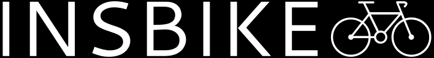

## Interface

### Proposta UX 1 - C

> - Mockup da interface:
>    - Satisfaz todos os requisitos do projeto &#x2705; 
>    - Indica quais são os widgets do LVGL &#x2705;  
>    LABEL, IMAGE, BUTTON, BASE OBJECT
>    - Apresentar uma foto da interface sendo executada no LCD (imagem estática) &#x2705;

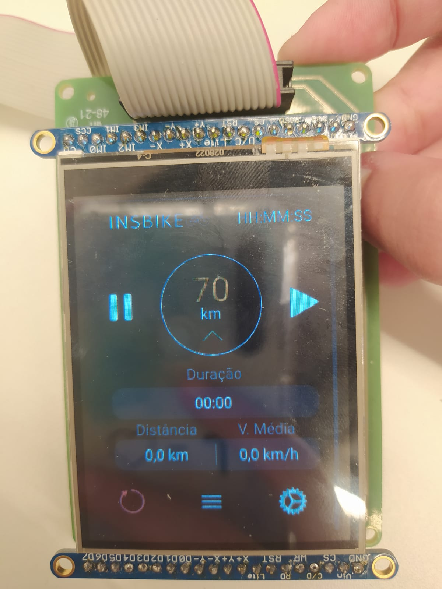
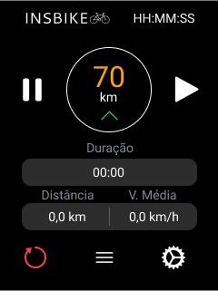
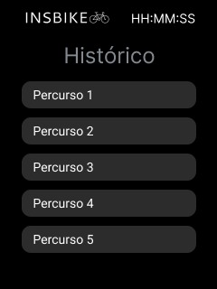
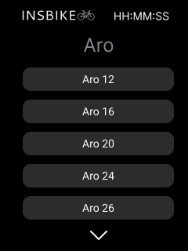

> - Grava um vídeo explicando a interface &#x2705;   

- Link para o vídeo: https://youtu.be/p1WgfblvrRM

Descrição da primeira proposta da interface:
- A tela começa com o logo da empresa no canto superior esquerdo e o horário atual no canto superior direito. Abaixo, se tem um círculo onde fica a velocidade instantânea do ciclista e a indicação da aceleração, sendo o play do lado para começar a corrida e o pause para pausar, aparecendo um quadrado logo depois para caso o ciclista queira salvar a corrida. Logo após, têm-se a duração, ou seja, o cronômetro contando o tempo do percurso. Em baixo, têm-se as medições da distância e da velocidade média, sendo seguido pelo botão de reiniciar/apaga no canto inferior esquerdo, o botão de histórico de percursos e o botão de configuração onde se troca o tamanho do aro da roda.

- Imagem da proposta &#x2705;
- Imagem da proposta no LCD &#x2705;
- Vídeo explicando a interface &#x2705;

### Proposta UX 2 - B

> - Especifica e justifica quais vão ser as fontes (e tamanhos) a serem usadas na interface.  &#x2705;
- Fonte escolhida foi a Roboto, por ser a mais usada em android's e a cor preto e branco foi baseada nos relógios smart fitness, além de ter maior contraste.
> - Pega feedback com o Luiz do Fablab e incorpora na interface.  &#x2705;
>   - Grava em vídeo a entrevista
- Link para o vídeo: https://youtu.be/UBOfn0IV4_k
> - Grava um vídeo atualizado explicando o que foi sugerido e o que fizeram para melhorar a interface. &#x2705;
- Link para o vídeo: https://youtu.be/lOV_jCf2ZGs
> - Apresentar uma foto da interface sendo executada no LCD (imagem estática). &#x2705;

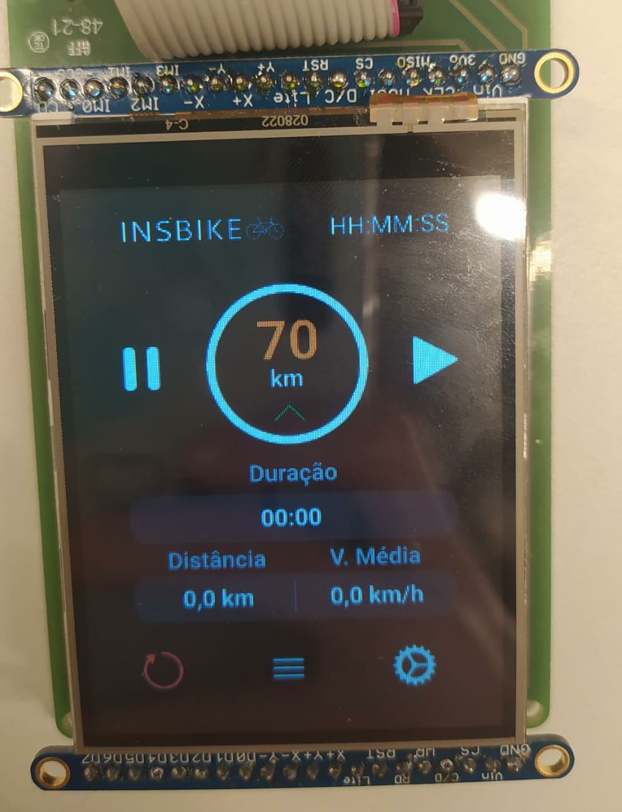
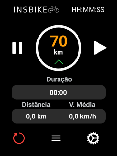
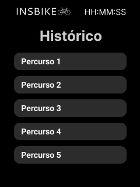
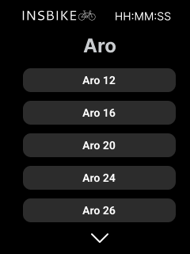

  
Detalhes da segunda interação da proposta de interface:

- Luiz falou principalmente sobre a borda da velocidade instântanea, que ele achou que poderia ser mais grossa para dar mais visibilidade e também deixar mais branco os títulos, como "distância", "cronômetro", e etc, porque ele estava achando muito escuro. Além disso, ele comentou também sobre a adição de alguma forma de voltar para  a página inicial após ir para a página de histórico e de configurações. Para isso, decidimos adicionar uma página a mais que apareceria por aproximadamente 2 segudos quando trocasse para outra página.  

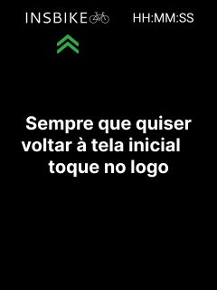

- Imagem da proposta &#x2705;
- Imagem da proposta no LCD &#x2705;
- Vídeo &#x2705;

### Proposta UX 3 - A

> - Especifica e justifica as cores a serem usadas na interface. &#x2705;
> - Pega feedback com mais uma pessoa externa e incorpora na interface. &#x2705;
>     - Grava em vídeo a entrevista. &#x2705;
- Link para o vídeo: https://youtu.be/DBiGGmODKco
> - Grava um vídeo atualizado explicando o que foi sugerido e o que fizeram para melhorar a interface. &#x2705;
- Link para o vídeo: https://youtu.be/K8pXIM5NEsE 
> - Apresentar uma foto da interface sendo executada no LCD (imagem estática). &#x2705;
- Design Final

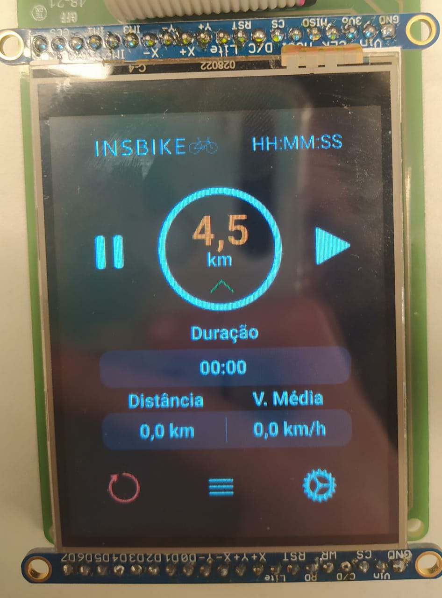
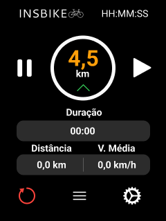
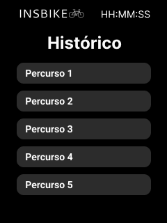
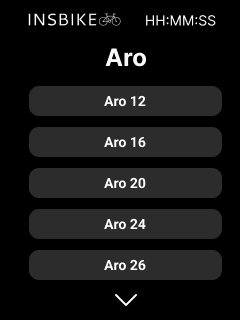

  

Detalhes da terceira interação da proposta de interface:
- Ana falou principalmente para deixar as cores dos títulos ainda mais brancas, porque estava com muita dificuldade para enxergar. Além disso, ela também falou que não era necessário o uso de uma quarta tela para representar a volta com o logo e que podiamos apenas apresentar no pitch. Outra coisa que ela pediu pra mudar, que mesmo sendo só representação, 70km é um valor muito absurdo de velocidade, então diminuir para algo mais plausível.

- Imagem da proposta.  &#x2705;
- Imagem da proposta no LCD.  &#x2705;
- Vídeo.  &#x2705;

### Iteração Final

Não foi possível implementar o histórico, porém foi adicionado uma ideia de buzina no local. Foi feita também algumas mudanças em questão de design em geral, e a adição também de um indicador de quer o trajeto está sendo gravado!
Link disponível para ver o funcionamento do ciclocomputador: https://youtu.be/VHmUJ8JxW8M
